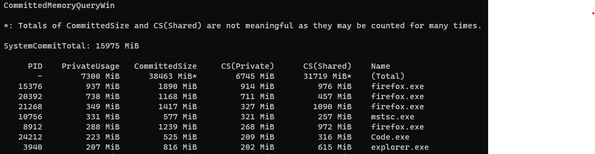

# CommittedMemoryQueryWin

## Overview

Memory leaks on Windows are difficult to diagnose.

Generally, we can check `Commit Charge Total` in `Task Manager`. It is the key signature for system overall memory status. The value is the total memory size of what the system promise to provide to all the processes. When it goes near or past the physical memory capacity, you will notice general system performance degradation, as the system will try to allocate space on hard disk(s) for page file(s). Windows doesn't do memory overcommitment like Linux, see [this](https://superuser.com/questions/1194263/will-microsoft-windows-10-overcommit-memory) and [this](https://unix.stackexchange.com/questions/521648/why-does-linux-by-default-overcommit-memory).

When we see `Commit Charge Total` is big, we can analyze in detail. `Commit Size` in Task Manager is a good start, but it doesn't count sizes of memory-mapped files (or shared memory, shared DLL images, etc). Don't waste time on anything with `WorkingSet` in its name, as working set is just the memory blocks of your process located in the physical memory, and it can be switched to and from the page file at any time. [RAMMap](https://docs.microsoft.com/en-us/sysinternals/downloads/rammap) can be used to analyze the overall composition and [VMMap](https://docs.microsoft.com/en-us/sysinternals/downloads/vmmap) can be used to analyze a single process.

The memory usage of a process consists of private memory usage, shared memory usage and some other small memory usage such as kernel objects. Unfortunately, Windows doesn't provide a way to get the exact share count for every shared memory block, see [this](https://docs.microsoft.com/en-us/windows/win32/api/psapi/ns-psapi-psapi_working_set_ex_block) and you can find that the maximum ShareCount is 7, which is usually not enough to contain the exact number. In addition, we can't get ShareCount for memory pages in the page file.

We can estimate process memory usage by examining all the virtual memory ranges and adding all private and shared memory usage separately, and it should be a value between `private` and `private + shared`.

VMMap can show these values for a single process but not all processes. So I created this tool to show these values for all processes at once.

## Functionality

## License

See [LICENSE](LICENSE).
